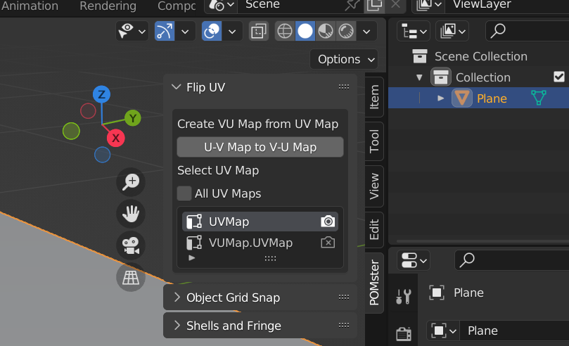
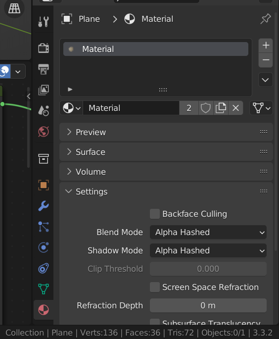

# POMster Geometry Nodes

## Usage
Usage is demonstrated with example:
1. Plane mesh with Shell and Fringe geometry and material shader nodes

### Example 1: Shell and Fringe Geometry and Material Shader Nodes
Plane mesh with Shell and Fringe geometry nodes combined with material shader nodes applied, to create a 'bumpy' depth effect with accurate shadows.

1. Create Plane, including UV map
3DView -> Add menu -> Mesh -> Plane

2. Create VU Map from UV Map
3DView -> Tools -> POMster -> Flip UV -> U-V Map to V-U Map

Create VU Map from the default UV Map with the Flip UV panel.
The VU Map is needed for V Tangent of texture coordinates, for use with Parallax Map node.
If UV Map is not available then other sources of Tangent U/V might be available, e.g. see "Ortho Tangents" button in the POMster node editor panel.

3. Add Object Shell and Fringe Geometry Nodes
3DView -> Tools -> POMster -> Shell and Fringe -> Shell and Fringe

Switch to Wireframe mode in 3DView, and zoom the view in to the edges of the plane, to see the shells and fringe created by the geometry nodes.

After the Shell and Fringe geometry nodes are applied, go to the Modifier Properties tab to see the default values input to Shell and Fringe.
These values are control how many shells are created, total depth of shells, etc.

The Min Height and Max Height values are important because they will be used to determine transparency of Shell and Fringe geometry - to make the 'bumpy' depth effect.

Set Min Height to -0.05
Set Max Height to 0.0

With Max Height equal 0.0 , the outermost 'shell' is exactly the same as the original geometry.
With Min Height equal -0.05 , the innermost 'shell' is 0.05 meters inside the original geometry.

Set Shell Count to 32 , this will add more detail to the depth effect.

3. Create Image Texture nodes
In the Shader Editor, create 3 Image Texture nodes:
   1. Color
   2. Normal
   3. Height (Displacement).

The example uses a Coast Sand texture that can be downloaded from PolyHaven.com - although any texture can be used.

4. Add Material Shell Fringe Blend Shader Nodes
Before pressing button to add nodes, ensure the "Add Shell Fringe Inputs" option is enabled.
Then set Base Color, Normal, and Height image values to the images used in the previous step.
Setting these image values will help save time later, because the addon will auto-populate generated Image Texture nodes with these values.

Shader Node Editor -> Tools -> POMster - > Shell and Fringe -> Shell Fringe Blend

Setting these image options before is faster than manually selecting/setting node values later.

Finally, before pressing the Shell Fringe Blend button, delete all nodes in the current material shader.
Pressing the Shell Fringe Blend button will create all nodes, including Material Output, needed to add the Shell and Fringe effect.

The material node setup should look like this:

Inside the CustomSF_Shader node is the shader (e.g. Principled BDSF) that is used to create the colors, heights, etc. of the material.

Changes that need to be made to the shader setup should be done mostly inside this node group - e.g. changing to Emission / Glass shaders.
Inside this node group is where any extra nodes for creating the material shader should be added.

Outside the node group are support nodes needed to make the Shell and Fringe Blend work, and these nodes can be used to control how much the effect is applied - e.g. Opaque / Shell blend by viewing angle.

5. Cycles Settings
Problem: Blender's Cycles renderer will show patches of black pixels when rendering geometry with Shell and Fringe applied.
Solution: Increase the number of Transparent bounces in Cycles renderer options for Light Paths.
Generally this number needs to be higher than the total number of 'shells' in the geometry.
E.g. if 32 shells are used, then set Transparent bounces to equal 40.
A margin of about 8 extra bounces is usually enough to eliminate the patches of black pixels.

Render Properties -> Light Paths -> Max Bounces -> Transparent

Note: Render Properties can be found in the Properties window which is on the bottom-right side of Blender's window by default.

6. EEVEE Settings
Problem: EEVEE renderer does not show transparency.
Solution: For each material with transparency, go to its Settings and turn on transparency.

Material Properties -> Settings -> Blend Mode -> Alpha Hashed

Blend Mode set to Alpha Blend  might also work.

Note: Material Properties can be found in the Properties window which is on the bottom-right side of Blender's window by default.

7. Complete
Comparing the before and after, the Shell and Fringe effect is especially noticeable where the edges of the geometry meet the background: a bumpy fringe can be seen.

