# POMster - Material Shader Nodes

## Usage
Usage is demonstrated with examples:
1. Plane mesh with Parallax Map node
2. Plane mesh with Offset Conestep Parallax Occlusion Map (OCPOM) node

### Example 1: Parallax Map node setup
This example is a plane with Parallax Map material shader nodes applied, to give a 'flat' depth effect.

1. Create Plane, including UV map
3DView -> Add menu -> Mesh -> Plane

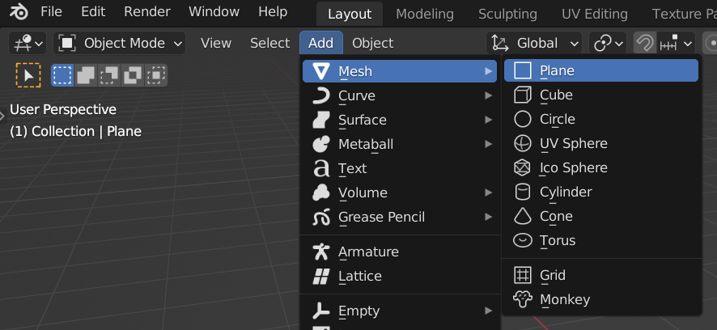

2. Create VU Map from UV Map
3DView -> Tools -> POMster -> Flip UV -> U-V Map to V-U Map

Create VU Map from the default UV Map with the Flip UV panel.
The VU Map is needed for V Tangent of texture coordinates, for use with Parallax Map node.
If UV Map is not available then other sources of Tangent U/V might be available, e.g. see "Ortho Tangents" button in the POMster node editor panel.

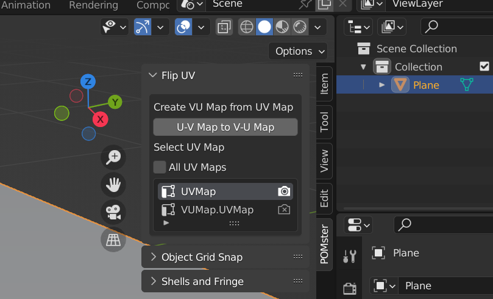

3. Create Image Texture nodes
Go to the Shader Editor, and create an Image Texture node.
The example uses a Coast Sand texture that can be downloaded from PolyHaven.com - although any texture can be used.

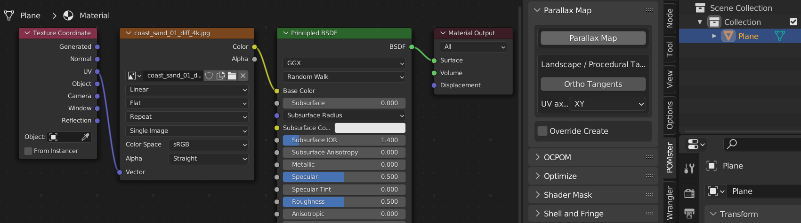

4. Create Parallax Map for UV Coordinates
Add Parallax Map node and connect to texture node.
Shader Editor -> Tools -> POMster -> Parallax Map -> Parallax Map

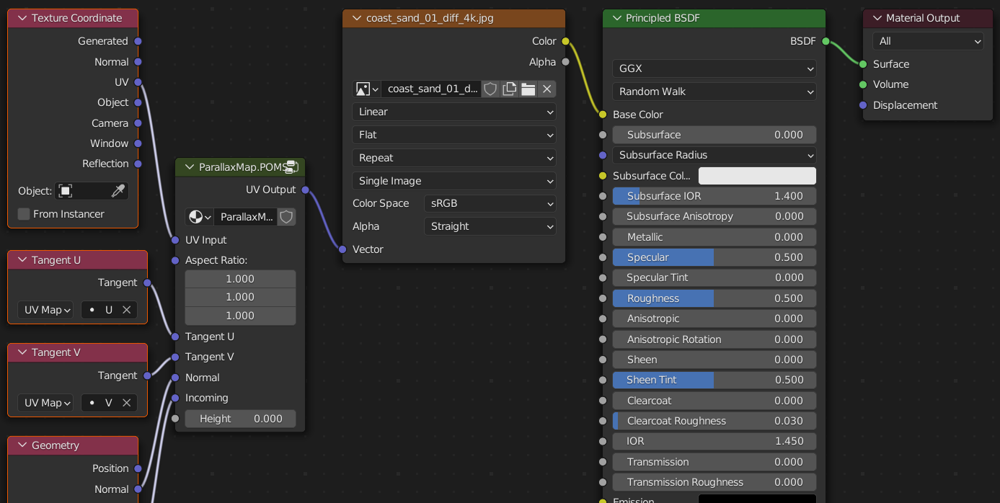

The UV Map and VU Map were automatically selected (based on default names "UVMap" and "VUMap.UVMap") for the U Tangent and V Tangent nodes.
If the UV Map and VU Map have names different from "UVMap" and "VUMap.UVMap", then these values will need to be filled in manually.

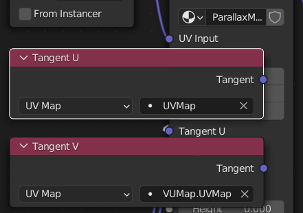

With the ParallaxMap.POMS node selected, change the Height value from 0.0 to -0.1

This will make the image texture appear to be inside the geometry, instead of flat at the geometry's surface.
Note: The parallax effect only works with negative Height values. Depth is negative Height, to be consistent when Height is used elsewhere in POMster.

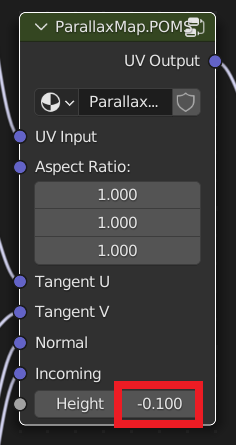

5. Complete
Comparing old material with new material, the new material's texture looks like it's inside the geometry.
The effect is is more noticable at edges, and at red-white Cursor at world origin.

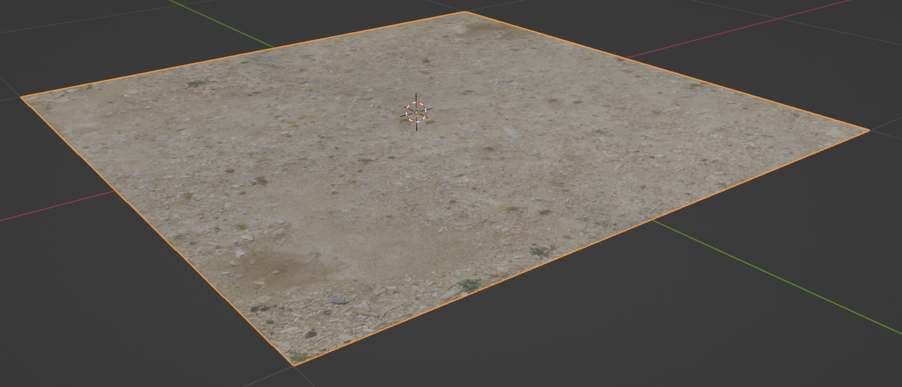

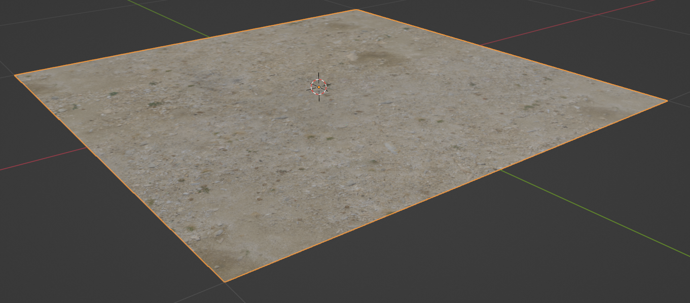

### Example 2: OCPOM node setup
This example is a plane with Offset Conestep Parallax Occlusion Map (OCPOM) material shader nodes applied, to give a 'bumpy' depth effect.

1. Create Plane, including UV map
3DView -> Add menu -> Mesh -> Plane

2. Create VU Map from UV Map
3DView -> Tools -> POMster -> Flip UV -> U-V Map to V-U Map

Create VU Map from the default UV Map with the Flip UV panel.
The VU Map is needed for V Tangent of texture coordinates, for use with Parallax Map node.
If UV Map is not available then other sources of Tangent U/V might be available, e.g. see "Ortho Tangents" button in the POMster node editor panel.

3. Create Image Texture nodes
In the Shader Editor, create an Image Texture node for color, and create an Image Texture node for height (displacement).
The example uses a Coast Sand texture that can be downloaded from PolyHaven.com - although any texture can be used.

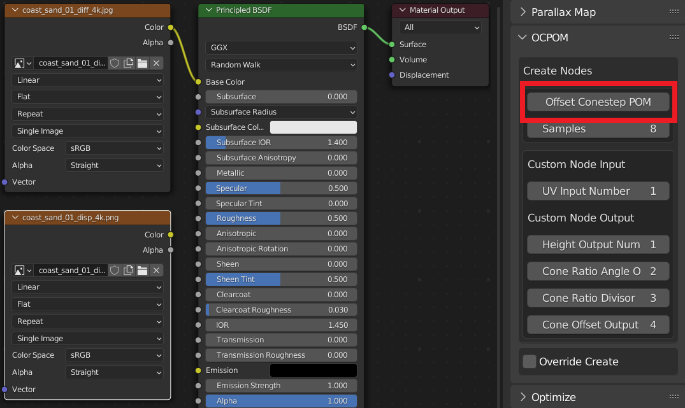

4. Create OCPOM for UV Coordinates
Add OCPOM node and connect to texture nodes.

Shader Editor -> Tools -> POMster -> OCPOM -> Offset Conestep POM

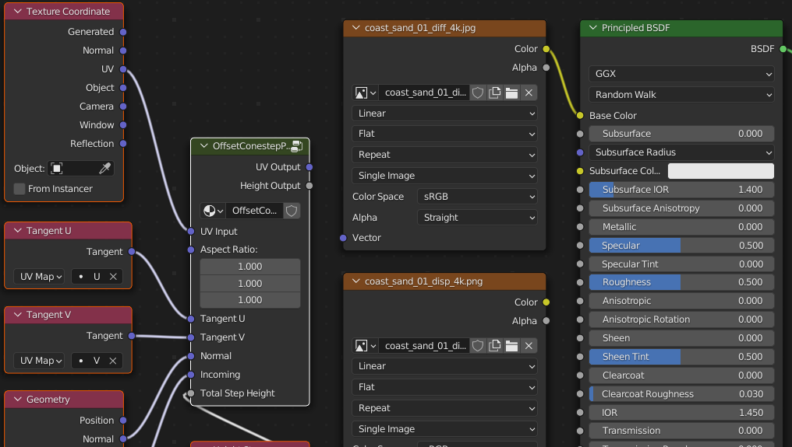

The UV Map and VU Map were automatically selected (based on default names "UVMap" and "VUMap.UVMap") for the U Tangent and V Tangent nodes.
If the UV Map and VU Map have names different from "UVMap" and "VUMap.UVMap", then these values will need to be filled in manually.

5. Fill in OCPOM Input node
Select heightmap Image Texture node and press Ctrl-C, or right click heightmap Image Texture node and select Copy.

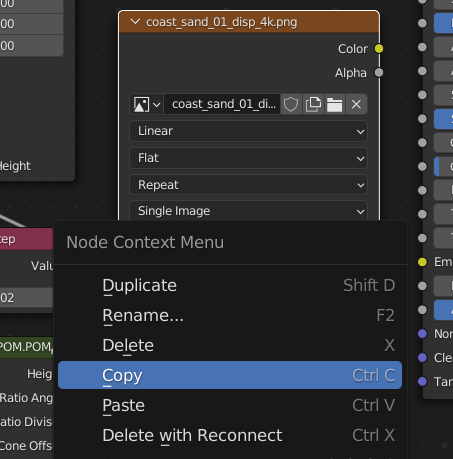

Select blank OCPOM input group node and press Tab to edit the node group.

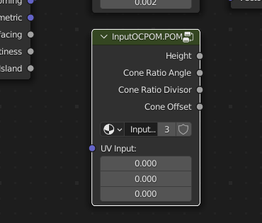

Once inside the OCPOM group node, press Ctrl-V or right-click an empty space and select Paste.

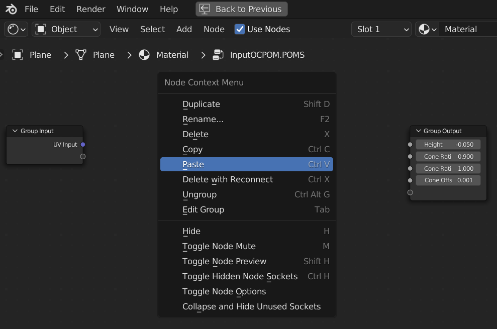

Link the Group Input node to the height (displacement) Image Texture node.
Create Math node to Subtract 1.0 from Color output of Image Texture node.
Create Math node to Multiply by 0.05 the Value output of Math Subtract node.

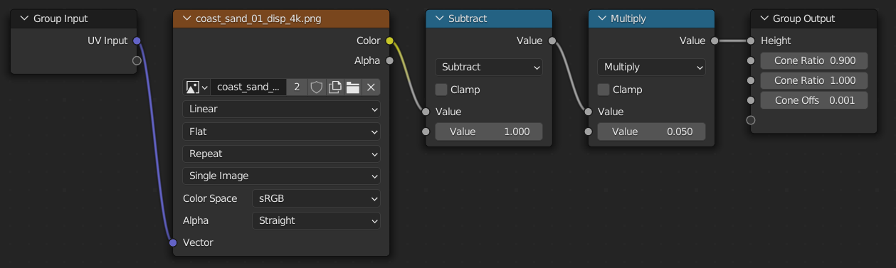

6. Complete
Comparing old material with new material, the new material's texture looks like it's inside the geometry.
The effect is is more noticable at edges, and at red-white Cursor at world origin.

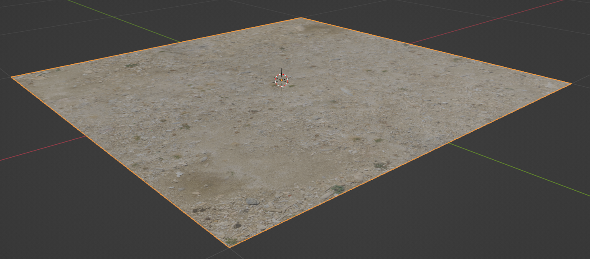

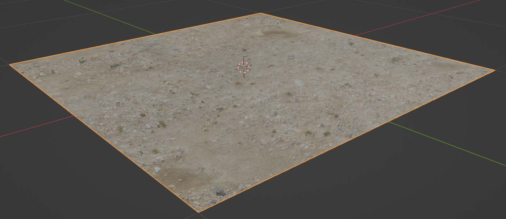
